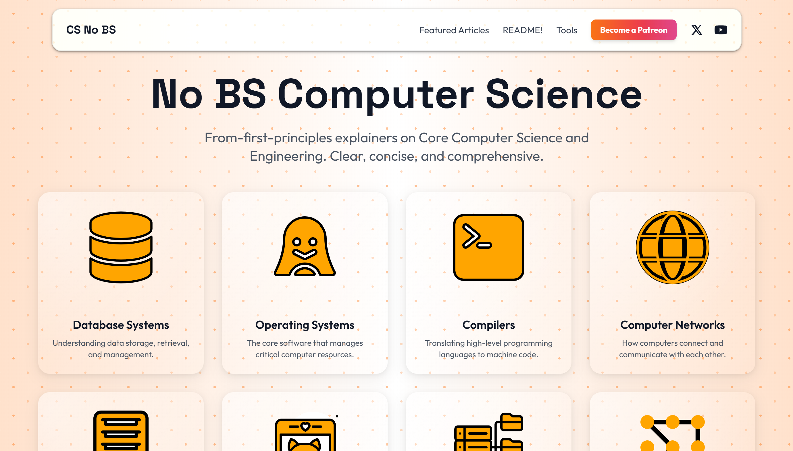
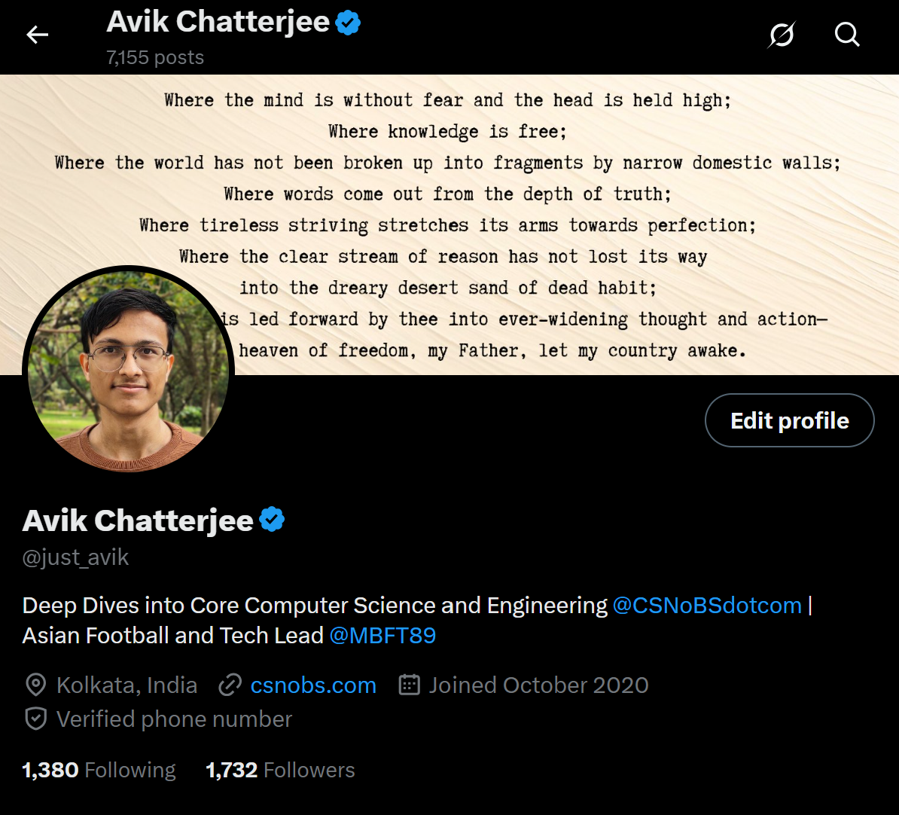
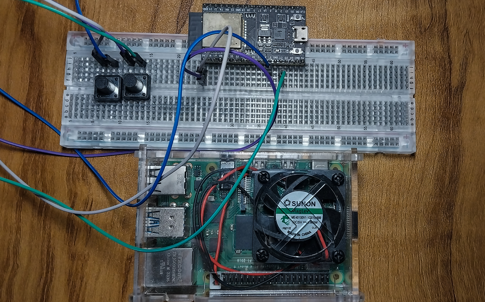

# Hey 👋 , I'm Avik 
### 💻 Full Stack (MERN and Low Code on Pega) | ⚙️ Embedded Systems | ✍️ Blogs on Core CS at [CSNoBS.com](https://csnobs.com)  
> Have made full stack freelance CRUD projects, interned at a Services MNC on Pega, a low code tool and and some passion projects in Embedded Systems with me RPi and ESP32 | Can develop quickly with AI assisted tools (don't worry I understand the code it generates)

---

---

## Who/What/Why Am I?

- 💻 Full-stack development (JS, React, Next, Node, Tailwind, AWS/GCP)
- ⚙️ Embedded Systems (Linux, Arduino C/C++, Python) and a bit of Robotics in near future
- 🤖 Fine Tuning models for various use cases (for future projects, nothing to show as of now)
- ⚽ Finding the balance between enjoying football through the numbers and the eyes (sticking to only one end of the spectrum doesn't give the full picture!)
- No BS CS Blogs at [CSNoBS.com](https://www.csnobs.com); 3000+ views on my "How Can You See This" article
- Tech and Editorial Lead at [MBFT](https://www.mbft.in/) (Currently redesigning our community engagement web app)

---

<h3 align="left">🌐 Find me (Most active on X)</h3>

  
  
  

---

<h3 align="left">🛠️ Languages & Tools</h3>

  
  
  
  
  
  
  
  
  
  
   
  

  
  

---

## 🌟 Featured Projects

### 🔘 [SlidePilot: RaspberryPi-ESP32 Remote PPT Display & Control System](https://github.com/justavik/RPI-ESP32-Remote-PPT-Display-Control)

> • Tools/Tech: Python, C++, Arduino BLE, BLE GATT, Raspberry Pi, ESP32  
> • Wireless presentation control using ESP32 via BLE  
> • Support for PowerPoint (PPTX) and PDF presentations  
> • Real-time slide conversion and caching  
> • Fullscreen presentation mode  
> • Responsive GUI with presentation list and status indicators  
> • Automatic BLE reconnection handling  
> • Comprehensive logging system  
> • System service for automatic startup  
> • External display support

### 🌐 [QUICie: RaspberryPi-ESP32 Remote PPT Display & Control System](https://github.com/justavik/RPI-ESP32-Remote-PPT-Display-Control)

> • Tools/Tech: Python (asyncio, cryptography, aioquic), HTTP/3, QUIC, UDP, Prometheus  
> • Minimal QUIC protocol implementation with HTTP/3 server, client testing, cryptographic handshakes, path migration, congestion control, and performance waterfall visualization for comparison with HTTP/1 over TCP

---

  

